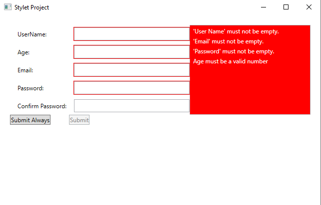

# StyletWpfExamples
- MyFirstStyletProject 
Basic MVVM Navigation example heavily inspired by by https://github.com/MeshackMusundi/StaffStuff-Stylet.
 
- StyletBasicNavigation
Basic MVVM Navigation including Modal.

 
- StyletBasicNavigation
Basic MVVM Validation.

 
